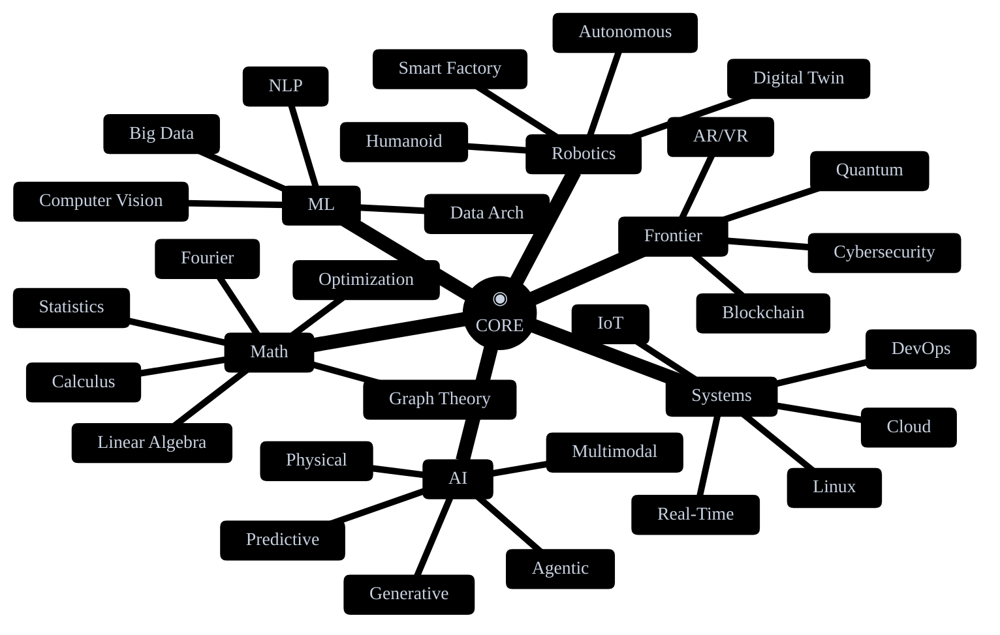
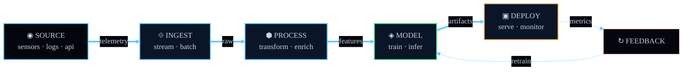

<!-- ══════════════════════════════════════════════════════════════ -->
<!--                       CAPSULE-RENDER HEADER                    -->
<!-- ══════════════════════════════════════════════════════════════ -->


<div align="right">
  <a href="https://code-repositories.github.io">
    
  </a>
  
  
</div>

<br>

<!-- ══════════════════════════════════════════════════════════════ -->
<!--                            BOOT SEQ                            -->
<!-- ══════════════════════════════════════════════════════════════ -->

```

    ╔═══════════════════════════════════════════════════════════╗
    ║                                                           ║
    ║    ◉  SYSTEM.BOOT   ─────────────────────────────────     ║
    ║                                                           ║
    ║    > owner        : code-repositories                     ║
    ║    > map          : code-repositories.github.io           ║
    ║    > channel      : code-repositories@proton.me           ║
    ║    > nodes        : 43 / 43 loaded                        ║
    ║    > sectors      : 07 active                             ║
    ║    > status       : ONLINE                                ║
    ║                                                           ║
    ╚═══════════════════════════════════════════════════════════╝

```

<div align="center">

[](https://git.io/typing-svg)

</div>

---

<!-- ══════════════════════════════════════════════════════════════ -->
<!--                           SCRIPTURE                            -->
<!-- ══════════════════════════════════════════════════════════════ -->

<div align="center">

<br>

*"Ask and it will be given to you; seek and you will find;*  
*knock and the door will be opened to you."*

<sub>— MATTHEW · 7:7 —</sub>

<br>


</div>

---

<!-- ══════════════════════════════════════════════════════════════ -->
<!--                       KNOWLEDGE MAP · ASCII                    -->
<!-- ══════════════════════════════════════════════════════════════ -->

```
> cat ./knowledge.map --render=ascii
```

```

                              ◉ HUB
                             /│╲
                ╭───────────╱ │ ╲───────────╮
              ╱             ╱   ╲             ╲
         [AI]────────────[ML]────[ROBOTICS]──[SYSTEMS]
          │               │          │           │
       GEN·AI          VISION    HUMANOID      LINUX
       AGENTIC         NLP       AUTONOMOUS    NETWORK
       PHYSICAL        BIG-DATA  DIGITAL-TWIN  SERVER
       MULTIMODAL      DATA-ARCH SMART-FACTORY CLOUD
       PREDICTIVE                              DEVOPS
                                               REAL-TIME
                                               IOT
              ╲             ╲   ╱             ╱
                ╰───────────╲ │ ╱───────────╯
                             ╲│╱
                       [MATH]────[SECURITY]
                         │            │
                      LINEAR      CRYPTO
                      CALCULUS    BLOCKCHAIN
                      STATS       QUANTUM
                      GRAPH       AR/VR
                      OPTIM       CYBERSEC
                      FOURIER
                      DIFF-EQ

```

<div align="right"><sub><code>43 NODES · 7 SECTORS · GOLDEN-ANGLE FIBONACCI ORBIT</code></sub></div>

---

<!-- ══════════════════════════════════════════════════════════════ -->
<!--                      MERMAID MINDMAP · INTEREST                -->
<!-- ══════════════════════════════════════════════════════════════ -->

```
> ./mindmap --render=interest-graph
```



---

<!-- ══════════════════════════════════════════════════════════════ -->
<!--                   MERMAID ARCHITECTURE · DATA FLOW             -->
<!-- ══════════════════════════════════════════════════════════════ -->

```
> ./architecture --show=dataflow
```



---

<!-- ══════════════════════════════════════════════════════════════ -->
<!--                            STACK                               -->
<!-- ══════════════════════════════════════════════════════════════ -->

```
> ./stack --list --sort=proximity
```

<div align="center">

<kbd><sub>LANGUAGES</sub></kbd>


<br>

<kbd><sub>AI · ML</sub></kbd>


<br>

<kbd><sub>FRONTEND · BACKEND</sub></kbd>


<br>

<kbd><sub>INFRA · DATA</sub></kbd>


</div>

---

<!-- ══════════════════════════════════════════════════════════════ -->
<!--                          TELEMETRY                             -->
<!-- ══════════════════════════════════════════════════════════════ -->

```
> ./telemetry --full-report
```

<div align="center">


<br><br>


</div>

<br>

<!-- WAKATIME -->
<details>
<summary><b><code>&gt; ./wakatime --coding-activity</code></b></summary>
<br>

<div align="center">


<sub><code>requires wakatime.com account + github action</code></sub>

</div>

</details>

---

<!-- ══════════════════════════════════════════════════════════════ -->
<!--                      CONTRIBUTION TIMELINE                     -->
<!-- ══════════════════════════════════════════════════════════════ -->

```
> ./timeline --visualize=activity
```

<div align="center">


</div>

<br>

<!-- SNAKE -->
<div align="center">

<sub><code>> ./snake --eat-contributions</code></sub>

<br><br>


</div>

<br>

<!-- 3D CONTRIB -->
<div align="center">

<sub><code>> ./profile-3d --render</code></sub>

<br><br>


</div>
---

<!-- ══════════════════════════════════════════════════════════════ -->
<!--                           CHANNELS                             -->
<!-- ══════════════════════════════════════════════════════════════ -->

```
> ./channels --open-all
```

<div align="center">

<a href="https://code-repositories.github.io">
  
</a>
&nbsp;
<a href="mailto:code-repositories@proton.me">
  
</a>

</div>

---

<!-- ══════════════════════════════════════════════════════════════ -->
<!--                             FOOTER                             -->
<!-- ══════════════════════════════════════════════════════════════ -->

<div align="center">

<br>

<sub><code>┌─ Move · Drag · Hover nodes · Press / to search ─┐</code></sub>

<br>

<sub><code>TAB</code> COMPLETE &nbsp;·&nbsp; <code>↵</code> JUMP &nbsp;·&nbsp; <code>ESC</code> EXIT</sub>

<br><br>

</div>


